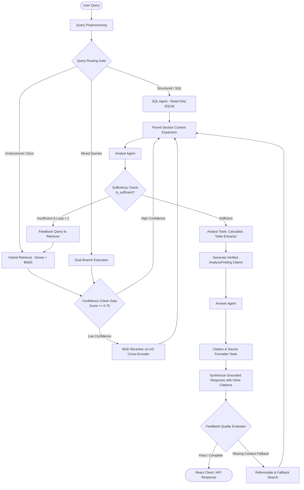

# Multi-Agent Multimodal RAG & Document Intelligence System

[](https://www.python.org/)
[](https://fastapi.tiangolo.com/)
[](https://github.com/langchain-ai/langgraph)
[](https://vitejs.dev/)
[](https://groq.com/)
[](https://huggingface.co/BAAI/bge-reranker-v2-m3)
[](#testing--verification)

A production-grade, multimodal **Multi-Agent RAG System** combining document ingestion pipelines, hybrid search (ChromaDB dense vectors + BM25Okapi sparse keywords), schema-aware read-only SQL execution, and a 3-agent collaborative hierarchy (**Retriever**, **Analyst**, **Answer**) coordinated via **LangGraph**. Features an interactive dark-themed **React UI** with glassmorphism aesthetics.

---

## Architecture & Multi-Agent Trajectory

The system executes queries through a stateful multi-agent pipeline with self-correcting feedback loops:



---

## Key Features

### 1. Structure-Aware Multi-Modal Ingestion Pipeline
- **Smart Type Detection**: Automatically classifies PDFs, spreadsheets (CSV, Excel), Markdown, JSON, XML, and code repositories.
- **Parent-Child Chunking**: Retains complete parent sections while extracting 250–500 token child chunks with hierarchical breadcrumbs (`Document > Section > Heading`).
- **Dynamic Relational Schemas**: Automatically maps CSVs and spreadsheets into indexed SQLite tables with LLM-introspected column metadata, data types, and sample records.
- **Symbol-Level Code Parsing**: Extracts functions, classes, signatures, imports, and docstrings for Python, JavaScript, TypeScript, Go, and Java.

### 2. Retrieval Agent & Confidence Gate
- **Hybrid Retrieval**: Combines 1024-dimensional dense embeddings (`BAAI/bge-m3`) with BM25Okapi sparse keyword ranking via Reciprocal Rank Fusion.
- **Confidence Scoring**: Evaluates candidate distribution; scores $\ge 0.75$ bypass reranking, while scores $< 0.75$ trigger cross-encoder reranking.
- **`BAAI/bge-reranker-v2-m3`**: Cross-encoder scoring deployed via Hugging Face Inference API with local fallback.
- **Parent Expansion**: Expands retrieved chunks into full parent sections and complete relational rows (`SELECT * FROM table WHERE row_id = ?`).

### 3. Merged Analyst & Answer Agents (`back_end/app/agents/`)
- **Analyst Agent**:
  - `CalculatorTool`: Exact arithmetic, percentage variance, averages, ratios, and statistics.
  - `TableExtractorTool`: Parses Markdown and pipe-delimited data tables.
  - `DocumentComparisonTool`: Cross-document diffing and comparative synthesis.
  - `RetrieveMoreEvidenceTool`: Queries the retriever for missing evidence when context is incomplete.
- **Answer Agent**:
  - `CitationFormatterTool`: Enforces ordered, deduplicated inline citation badges (`[1]`, `[2]`).
  - `SourceFormatterTool`: Renders human-readable source bibliography lines.
  - **Strict Grounding**: Refuses to hallucinate missing facts or fabricate claims outside the retrieved evidence.

### 4. Modern React Frontend (`frontend/`)
- Built with **React 19 + Vite** and styled strictly with **Vanilla CSS tokens** (no Tailwind).
- **Agent Chat & Reasoning**: Multi-agent progression stepper, sample query pills, interactive citation badges, expandable findings drawer, extracted tables, and SQL execution inspect tabs.
- **Document Ingestion**: Drag-and-drop file upload zone, structured relational table options, ingestion statistics, and source catalog.
- **SQL Datasets & Schema**: Table browser, column schema introspection, and live record previewer.
- **Observability & Telemetry**: Live system telemetry cards, full architecture diagram, and `RAGState` field specifications.

---

## Repository Structure

```
├── back_end/
│   ├── app/
│   │   ├── agents/            # Merged Analyst & Answer Agents + Adapters
│   │   │   ├── analyst_agent.py
│   │   │   ├── answer_agent.py
│   │   │   ├── analyst_tools.py
│   │   │   ├── answer_tools.py
│   │   │   ├── retriever_adapter.py
│   │   │   └── llm_adapter.py
│   │   ├── api/               # FastAPI REST Endpoints
│   │   │   ├── routes_ingest.py
│   │   │   ├── routes_query.py
│   │   │   ├── routes_metadata.py
│   │   │   └── routes_health.py
│   │   ├── core/              # LLM, Embeddings, Reranker & Logging
│   │   │   ├── llm.py
│   │   │   ├── embeddings.py
│   │   │   ├── reranker.py
│   │   │   └── logging.py
│   │   ├── database/          # SQLite & ChromaDB Vector Store
│   │   │   ├── registry.py
│   │   │   ├── sql_store.py
│   │   │   └── vector_store.py
│   │   ├── ingestion/         # Parsers, Chunkers & Pipeline Coordinator
│   │   ├── retrieval/         # Query Router, Hybrid Search, Confidence Check
│   │   ├── workflow/          # LangGraph Graph & State Machine
│   │   │   ├── graph.py
│   │   │   └── state.py
│   │   ├── config.py          # Settings & Environment Variables
│   │   └── main.py            # FastAPI App & Static File Server
│   ├── tests/                 # Backend Integration Test Suite (19 tests)
│   └── requirements.txt
├── Answer&Analyst/            # Original Core Agent & Tool Modules
│   └── tests/                 # Agent & Tool Unit Test Suite (13 tests)
├── frontend/                  # React + Vite Single Page Application
│   ├── src/
│   │   ├── components/
│   │   │   ├── Navbar.jsx
│   │   │   ├── ChatView.jsx
│   │   │   ├── IngestView.jsx
│   │   │   ├── DatasetsView.jsx
│   │   │   └── LogsView.jsx
│   │   ├── App.jsx
│   │   └── index.css          # Vanilla CSS Design System
│   ├── index.html
│   ├── package.json
│   └── vite.config.js
├── .env.example
└── README.md
```

---

## Getting Started

### Prerequisites
- Python 3.10+
- Node.js 18+ and npm
- A [Groq API Key](https://console.groq.com/) (Free tier on-demand: `qwen/qwen3.8-27b`)
- A [Hugging Face User Access Token](https://huggingface.co/settings/tokens)

### 1. Clone & Configure Environment

```bash
git clone https://github.com/AnasOsama2/Multi_Agent_System_celluala_week7.git
cd Multi_Agent_System_celluala_week7

# Copy environment template
cp .env.example .env
```

Edit `.env` and fill in your API keys:
```ini
groq_key="gsk_..."
HF_token="hf_..."
```

### 2. Install Backend Dependencies

```bash
pip install -r back_end/requirements.txt
```

### 3. Build the React Frontend

```bash
cd frontend
npm install
npm run build
cd ..
```
*(The production build will be saved to `frontend/dist/` and automatically served by FastAPI).*

---

## Running the Application

### Option A: Integrated Single-Server Mode (Recommended)
Run FastAPI directly from the `back_end/` directory:

```bash
cd back_end
python -m uvicorn app.main:app --host 0.0.0.0 --port 8000 --reload
```

- **Interactive Web UI**: [http://localhost:8000/](http://localhost:8000/)
- **Swagger API Documentation**: [http://localhost:8000/docs](http://localhost:8000/docs)
- **API Base Endpoint**: `http://localhost:8000/api/v1`

### Option B: Frontend Hot-Reload Development Mode
If actively modifying frontend components:

1. **Start Backend Server**:
   ```bash
   cd back_end
   python -m uvicorn app.main:app --host 127.0.0.1 --port 8000 --reload
   ```

2. **Start Frontend Dev Server**:
   ```bash
   cd frontend
   npm run dev
   ```
   Open [http://localhost:5173/](http://localhost:5173/) (Vite automatically proxies `/api` requests to `http://127.0.0.1:8000`).

---

## API Reference

| Method | Endpoint | Description |
|---|---|---|
| `POST` | `/api/v1/query` | Execute multi-agent RAG query (SQL, Hybrid, or Mixed) |
| `POST` | `/api/v1/query/stream` | Stream reasoning tokens via Server-Sent Events (SSE) |
| `POST` | `/api/v1/ingest` | Upload file (PDF, CSV, Excel, Code, MD) for parsing & indexing |
| `GET` | `/api/v1/sources` | List all ingested sources and section counts |
| `GET` | `/api/v1/datasets` | List registered relational SQL tables |
| `GET` | `/api/v1/schemas` | Introspect complete relational schema catalog |
| `GET` | `/api/v1/tables/{table_name}` | Fetch column metadata and sample rows for a table |
| `GET` | `/api/v1/health` | System status, connected DBs, and model configurations |

---

## Testing & Verification

The repository includes a comprehensive test suite covering ingestion, SQL safety, vector/hybrid retrieval, agent collaboration, and API routes:

```bash
# Run backend integration tests (19 tests)
pytest back_end/tests -v

# Run Analyst & Answer Agent tests (13 tests)
pytest "Answer&Analyst/tests" -v
```

All **32 tests** pass with 100% success.
